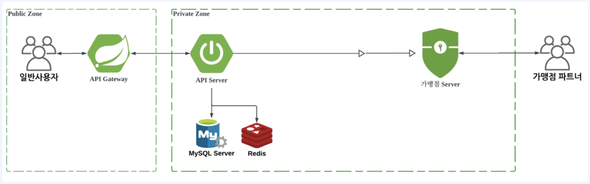
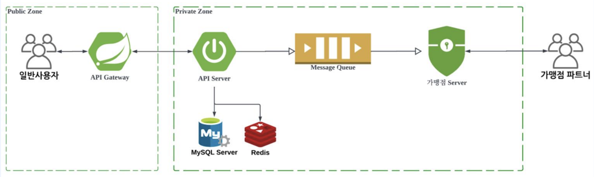

# Sync & Async

## Sync (동기)
요청이 끝날 때까지 기다렸다가 응답

<br/>
단점: 모든 사용자들의 요청이 계속해서 밀릴 수 있습니다.

## Async (비동기)
요청에 대한 작업이 수행되는 동안 다른 작업도 수행 가능

<br/>
1. 사용자가 주문을 요청합니다.
2. 사용자 요청을 API Server에서 받고 주문이 완료되었다고 응답을 줍니다.
3. 사용자는 거래 현황을 조회하거나 특정 서버에서 보내주는 푸쉬로 알게 됩니다.
4. 요청은 Queue에 집어넣고 연결은 끝납니다. => 더 이상 통신 비용이 발생하지 않습니다.

=> 순차적으로 가맹점 서버에 전송을 해주지 않습니다.<br/>
=> 비동기적으로 **푸시 알림**을 많이 사용합니다.

<br/>

## Kafka에서 Sync/Async 예시

### Kafka - Sync

프로듀서는 메시지를 보내고 send() 메서드에서 Java Future 객체로 RecordMetadata를 리턴받게 됩니다.<br/>
.get() 메서드를 이용해서 Future를 기다린 후 send() 메서드가 수행됩니다.<br/>
이 방법으로, 메시지가 브로커에게 메시지를 성공적으로 전달했는지 확인할 수 있기 때문에 더욱 신뢰성 있는 메시지 전송을 할 수 있습니다.

> **Java Future의 get()** 메서드<br/>
> 연산의 결과를 반환합니다. 만약 연산이 아직 완료되지 않았다면, 완료될 때까지 기다립니다.

<br/>

### Kafka - Async

비동기적으로 메시지를 전송해서 응답을 기다리지 않고 바로 다음 일을 수행하기 때문에 더욱 빠른 전송을 할 수 있습니다.<br/>
프로듀서는 send() 메서드를 콜백과 같이 호출하고 kafka 브로커에서 응답을 받으면 콜백합니다.

```java
import org.apache.kafka.clients.producer.Callback;
import org.apache.kafka.clients.producer.RecordMetadata;

public class ProducerCallback implements Callback {
	public void onCompletion(RecordMetadata metadata, Exception exception) {
		if (metadata != null) {
			System.out.printf("Partition: %d, Offset: %d", metadata.partition(), metadata.offset());
		} else {
			exception.printStackTrace();
		}
	}
}
```
```java
import com.kafka.producer.async.ProducerCallback;
import org.apache.kafka.clients.producer.*;

import java.util.Properties;

public class ProducerApplication {

    public static void main(String[] args) {
        Properties props = new Properties();
        props.put("bootstrap.servers", "127.0.0.1:9092");
        props.put("key.serializer", "org.apache.kafka.common.serialization.StringSerializer");
        props.put("value.serializer", "org.apache.kafka.common.serialization.StringSerializer");

        Producer<String, String> producer = new KafkaProducer<String, String>(props);
        try {
            producer.send(new ProducerRecord<String, String>("kafka-my-topic", "Apache Kafka Producer Test"), new ProducerCallback());
        } catch (Exception exception) {
            exception.printStackTrace();
        } finally {
            producer.close();
        }
    }
}
```

<br/>

## Rabbit MQ

오픈 소스 메시지 브로커 소프트웨어
1. 메시지 브로커는 송신자와 수신자 간의 효율적인 메시지 전달을 중개하는 역할을 담당 합니다.
2. RabbitMQ는 AMQP(Advanced Message Queuing Protocol)를 기반으로 작동하며, 대규모 분산 시스템에서 사용
   되는 메시지 큐 서비스를 제공합니다.
3. RabbitMQ는 프로듀서(메시지를 생성하는 애플리케이션)와 컨슈머(메시지를 소비하는 애플리케이션) 간의 비동
   기적인 통신을 용이하게 합니다.
4. 프로듀서는 메시지를 RabbitMQ에 보내고, RabbitMQ는 이를 큐에 저장합니다. 그런 다음 컨슈머는 큐에서 메시
   지를 가져와 처리할 수 있습니다.

RabbitMQ는 여러 애플리케이션 간의 통신을 향상시키고, 비동기 처리를 지원하여 시스템의 확장성과 유연성을 높
입니다. 또한, RabbitMQ는 다양한 기능을 제공하여 메시지 라우팅, 메시지 필터링, 우선순위 지정 등의 작업을 수
행할 수 있습니다.
RabbitMQ는 많은 프로그래밍 언어와 통합이 가능하며, 다양한 플랫폼에서 사용할 수 있습니다. 이를 통해 분산 시
스템, 마이크로서비스 아키텍처, 이벤트 기반 시스템 등에서 메시지 기반 통신을 구현할 수 있습니다.
그 외 AMQP 기반 QUEUE
Apache ActiveMQ, Apache Qpid 등등